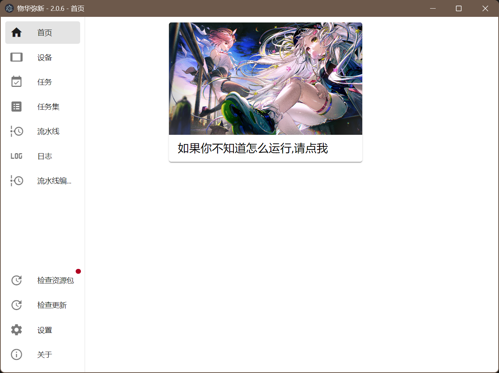

<!--
 * @Author: Night-stars-1 nujj1042633805@gmail.com
 * @Date: 2024-09-06 17:06:15
 * @LastEditors: Night-stars-1 nujj1042633805@gmail.com
 * @LastEditTime: 2024-12-02 15:25:12
-->
# maa-gui

基于MAA流水线协议的GUI

## 截图


## 项目安装

### 安装

```bash
git clone --recursive https://github.com/Night-stars-1/maa-gui.git
$ pnpm install
```

### 开发

- 根据`.env`的提示更改`.env`
- 根据`dev-app-update.yml`和`electron-builder.yml`的提示更改文件
```bash
$ pnpm dev
```

### Build

```bash
# For windows
$ pnpm build:win

# For macOS
$ pnpm build:mac

# For Linux
$ pnpm build:linux
```

## MAA行为扩展
> 在`src\main\customMaa`中注册自定义行为，以达到更灵活的控制  
**最简示例：**
```json
{
    "识别并点击确认图标": {
        "next": [
            "我的自定义任务"
        ]
    },
    "我的自定义任务": {
        "recognition": "Custom",
        "custom_recognition": "MyReco",
        "action": "Custom",
        "custom_action": "MyAct"
    }
}
```
```ts
import * as maa from '@nekosu/maa-node'
const MyReco: maa.CustomRecognizerCallback = async (self) => {
  const data = await self.context.run_recognition('OCR', self.image, {
    OCR: { recognition: 'OCR', expected: '', roi: [593, 113, 516, 46] }
  })
  if (!data) {
    console.log('未识别到内容')
    return null
  }
  return null
}

function registerCustom(res: maa.Resource) {
  res.register_custom_recognizer('MyReco', MyReco)
}
```
### Thanks
- [MaaFramework](https://github.com/MaaXYZ/MaaFramework)
